# GKE Sandbox for Confidential ML Inference

Demonstration and step-by-step tutorial on how to construct a GKE cluster sandbox.

Essentially, what this will provide is a construct namespace within a cluster where a remote party can deploy and run services but where the cluster owner is guaranteed several security characteristics.

Its best described in prose:

* Alice authored some proprietary and sensitive machine learning model.
* Bob (in another organization) wants to use that model for inference in a GKE cluster
* Alice does not want Bob to view the the model but Alice is ok if he uses it

The problem is that if Bob creates a GKE cluster and runs Alice's model within that, he has root ownership of the cluster and can ultimately find a way to access the model once its downloaded from Alice.

However, if Alice herself creates a GKE cluster, she can apply constraints to that cluster's namespace and only allow Bob a specific set of operations.  Alice can also enforce that Bob can only deploy container images in the cluster she approves.

How does Alice and Bob do this?

The trick involves inverting the control and ownership in a way that Alice can give Bob a sandbox GKE namespace:

Its like this:

1. Alice creates an ML model
2. Alice encrypts it with a KMS key
3. Alice saves it to a GCS bucket
4. Bob creates a container runtime in his org which after authorization will download, decrypt and run the model 
5. Bob allows alice to use his GCP Billing Account
6. Alice uses the Billing Account to:
   - create a Folder within her org
   - set an Organization Policy constraint on that folder to only allow confidential-node creation
   - creates a Binary Authorization policy which only allows images signed by her trusted attestors
   - creates a project which enforces binary authorization verification 
   - creates a GKE cluster constrained by the binary authorization policy and workload federation for a specific namespace
7. Alice authorizes the GKE worload federation service account access to download and decrypt the model.
8. Alice reviews Bob's container image 
9. Alice and authorizes it for deployment
10. Alice configures Gatekeeper to only allow images from Bob's repo
11. Alice grants Bob minimal permissions and restricts cluster operations with RBAC
12. Alice grants reader/minimal IAM permission to Bob for the the cluster
13. Bob allows the cluster's node service account ability to download the harness container image.
14. Bob deploys the container image (harness).  At this point the image does not contain the ML model
15. Gatekeepr authorizes image for deployment (this is in addition to the binary authorization signature checks)
16. Container uses the ambient workload federation credentials to download the ML model, decrypt it and get it ready for inference.


This tutorial will walk you through all that but each step must be followed precisely.

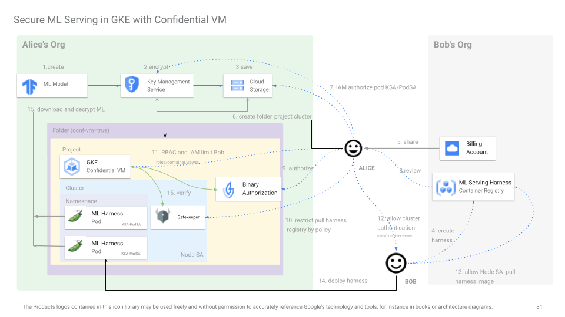

>>> **NOTE**: this code is NOT supported by Google and is experimental; caveat emptor.

### Create Projects

First we need three projects and two players:  Alice who owns the image, and Bob who wants to use it.

The `MODEL_PROJECT` is used by Alice to generate the ML model.

The `HARNESS_PROJECT` is used by Bob to create the harness image

The `CLUSTER_PROJECT` is used by Alice to create the sandbox cluster

In your case below, you'll need to pick different projects names but you get the idea

---


```bash
## select three projects
export MODEL_PROJECT=a-demo-model
export HARNESS_PROJECT=b-demo-harness
export CLUSTER_PROJECT=ab-demo-cluster

export MODEL_PROJECT_NUMBER=$(gcloud projects describe "$MODEL_PROJECT" --format 'get(projectNumber)')
export HARNESS_PROJECT_NUMBER=$(gcloud projects describe "$HARNESS_PROJECT" --format 'get(projectNumber)')
export CLUSTER_PROJECT_NUMBER=$(gcloud projects describe "$CLUSTER_PROJECT" --format 'get(projectNumber)')

# given the two users (who maybe in different domains)
export ALICE=alice@domain.com
export BOB=bob@domain.com

echo $MODEL_PROJECT
echo $HARNESS_PROJECT
echo $CLUSTER_PROJECT

echo $MODEL_PROJECT_NUMBER
echo $HARNESS_PROJECT_NUMBER
echo $CLUSTER_PROJECT_NUMBER

echo $ALICE
echo $BOB
```


### Alice

As alice, create the ML model.  The one in this repo is just [Basic text classification](https://www.tensorflow.org/tutorials/keras/text_classification)


```bash
gcloud config set account $ALICE
gcloud config set project $MODEL_PROJECT
gcloud auth application-default login


### Alice has the following permissions to do the required tasks
#### you could probably do with a lot less but  this is just what i used

$ gcloud organizations get-iam-policy 673208786098

    bindings:
    - members:
      - user:alice@domain.com
      role: roles/billing.user
    - members:
      - user:alice@domain.com
      role: roles/iam.denyAdmin
    - members:
      - user:alice@domain.com
      role: roles/orgpolicy.policyAdmin
    - members:
      - user:alice@domain.com
      role: roles/resourcemanager.folderCreator
    - members:
      - user:alice@domain.com
      role: roles/resourcemanager.folderViewer
    - members:
      - user:alice@domain.com
      role: roles/resourcemanager.projectCreator
    - members:
      - user:alice@domain.com
      role: roles/resourcemanager.projectIamAdmin


## alice has her own billing account and will generate and store the image here
gcloud projects create $MODEL_PROJECT

gcloud billing accounts list

    ACCOUNT_ID            NAME                   OPEN   MASTER_ACCOUNT_ID
    000C16-9779B5-30076F  gcard                  True

gcloud  billing projects link $MODEL_PROJECT  --billing-account=000C16-9779B5-30076F

gcloud services enable cloudkms.googleapis.com storage.googleapis.com \
     containeranalysis.googleapis.com artifactregistry.googleapis.com  binaryauthorization.googleapis.com --project $MODEL_PROJECT
```

#### Generate Model

Now alice generates the model

```bash
cd generate_model

virtualenv env
source env/bin/activate
pip3 install -r requirements.txt

wget https://ai.stanford.edu/~amaas/data/sentiment/aclImdb_v1.tar.gz


python3 generate.py

mkdir -p my_model/1

## tar the model and move it to the /encrypt/ folder
tar cvzf my_model.tar.gz my_model/
mv my_model.tar.gz ../encrypt/
```

#### Encrypt and upload

Alice now encrypts the model with a KMS key

```bash
gcloud config set account $ALICE
gcloud kms keyrings create mykeyring --location=us-central1 --project $MODEL_PROJECT
gcloud kms keys create --keyring=mykeyring --location=us-central1 --purpose=encryption  key1  --project $MODEL_PROJECT
gcloud kms keys list --location=us-central1 --keyring=mykeyring  --project $MODEL_PROJECT
```
  
Encrypt it:

```bash
gcloud config set account $ALICE
cd encrypt/

# edit encrypt.py, decrypt.py and set the KMS URI with the project
   # key_uri="gcp-kms://projects/$MODEL_PROJECT/locations/us-central1/keyRings/mykeyring/cryptoKeys/key1"

virtualenv env
source env/bin/activate
pip3 install -r requirements.txt

# save the key that was used
python3 encrypt.py > tink_key.json
```

this will print out the encrypted tink key, save that.  the model is encrypted as `my_model.tar.gz.enc`


My key looks something like this; yours will be different
```json
cat tink_key.json | jq '.'
{
  "encryptedKeyset": "AAAAcwokAJ7xtzA7UOT/m/YaY0YjOVPFfMPANnKuBnx6zgh5/zWYZM10EksAtyrKgAE1T052/mT50ueKXDfJVUEVTujlL0aep6YXdXgeDUqRQL/cONHVTM7SkHUShu3WPMkbtiylEpxF6CK4Z8cmosxzd5NM5uJIyG36loLBXgAK1asHznL3gY+kPHCwor+Fm8gx0nadURKXOx3x8VjDyz8uHcgCn1Y4AvxlaS4chxMEZksQZUaw5IPnmKVQEM6XkO/EKRI/amwsRWr5Y7/K1/yrYSt7Aev7UlbyEmhPtxwWOjo8EenLDpAPOGVksENYmJwRhOYicNSrubnNnZdHqRL/UkjFJYeVvN5uejVETeR178HTyRv8q3/4YHQ=",
  "keysetInfo": {
    "primaryKeyId": 471357398,
    "keyInfo": [
      {
        "typeUrl": "type.googleapis.com/google.crypto.tink.AesCtrHmacStreamingKey",
        "status": "ENABLED",
        "keyId": 471357398,
        "outputPrefixType": "RAW"
      }
    ]
  }
}
```

#### Upload to GCS bucket

Alice now uploads the encrypted model and attaches the b64 encoded json key as metadata

```bash
gcloud config set account $ALICE
gcloud storage buckets create gs://$MODEL_PROJECT-bucket --project $MODEL_PROJECT

gcloud storage cp my_model.tar.gz.enc gs://$MODEL_PROJECT-bucket --custom-metadata=encryption-key=`tr -d "\n\r" < tink_key.json | base64 -w 0`  --project $MODEL_PROJECT

$ gcloud storage objects describe gs://$MODEL_PROJECT-bucket/my_model.tar.gz.enc

        bucket: a-demo-model-bucket
        content_type: application/octet-stream
        custom_fields:
          encryption-key: eyAgImVuY3J5cHRlZEtleXNldCI6ICJBQUFBY3dva0FKN3h0ekE3VU9UL20vWWFZMFlqT1ZQRmZNUEFObkt1Qm54NnpnaDUveldZWk0xMEVrc0F0eXJLZ0FFMVQwNTIvbVQ1MHVlS1hEZkpWVUVWVHVqbEwwYWVwNllYZFhnZURVcVJRTC9jT05IVlRNN1NrSFVTaHUzV1BNa2J0aXlsRXB4RjZDSzRaOGNtb3N4emQ1Tk01dUpJeUczNmxvTEJYZ0FLMWFzSHpuTDNnWStrUEhDd29yK0ZtOGd4MG5hZFVSS1hPeDN4OFZqRHl6OHVIY2dDbjFZNEF2eGxhUzRjaHhNRVprc1FaVWF3NUlQbm1LVlFFTTZYa08vRUtSSS9hbXdzUldyNVk3L0sxL3lyWVN0N0FldjdVbGJ5RW1oUHR4d1dPam84RWVuTERwQVBPR1Zrc0VOWW1Kd1JoT1lpY05TcnVibk5uWmRIcVJML1VrakZKWWVWdk41dWVqVkVUZVIxNzhIVHlSdjhxMy80WUhRPSIsICAia2V5c2V0SW5mbyI6IHsgICAgInByaW1hcnlLZXlJZCI6IDQ3MTM1NzM5OCwgICAgImtleUluZm8iOiBbICAgICAgeyAgICAgICAgInR5cGVVcmwiOiAidHlwZS5nb29nbGVhcGlzLmNvbS9nb29nbGUuY3J5cHRvLnRpbmsuQWVzQ3RySG1hY1N0cmVhbWluZ0tleSIsICAgICAgICAic3RhdHVzIjogIkVOQUJMRUQiLCAgICAgICAgImtleUlkIjogNDcxMzU3Mzk4LCAgICAgICAgIm91dHB1dFByZWZpeFR5cGUiOiAiUkFXIiAgICAgIH0gICAgXSAgfX0=
        etag: CKKhyL2U24QDEAE=
        metageneration: 1
        name: my_model.tar.gz.enc
        size: 1882052
        storage_url: gs://a-demo-model-bucket/my_model.tar.gz.enc#1709574280319138
```

at this point, the model is in encrypted state on GCS


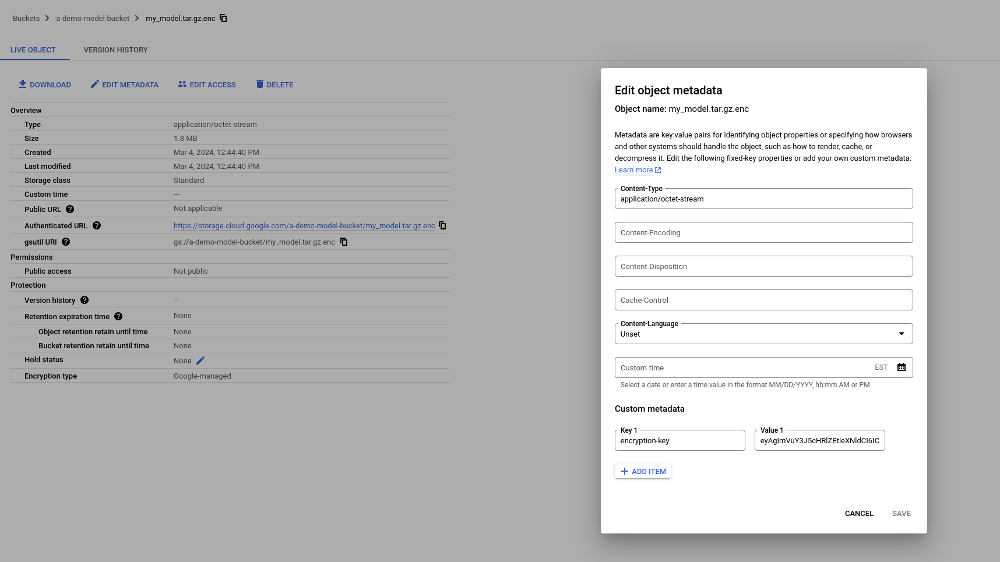


#### Create BinAuthz

Alice creates a bin authz policy in her own project to enforce signatures.

The attestor below is using a simple GPG key which i provided the keys to you

```bash
gcloud config set account $ALICE
gcloud config set project $MODEL_PROJECT

cd alice/

cp -R $HOME/.gnupg $HOME/gnupg_original
cp -R gnupg_alice $HOME/.gnupg

gpg --armor --output public.pem --export 087EA98DB38779D98097F7414429C55979783392

gcloud container binauthz attestors create attestor-1 \
    --attestation-authority-note=note-1 \
    --attestation-authority-note-project=$MODEL_PROJECT  

gcloud  container binauthz attestors public-keys add \
    --attestor=attestor-1 \
    --pgp-public-key-file=public.pem --project=$MODEL_PROJECT

gcloud container binauthz  attestors describe attestor-1 --project=$MODEL_PROJECT

      name: projects/a-demo-model/attestors/attestor-1
      updateTime: '2024-03-03T18:17:33.227663Z'
      userOwnedGrafeasNote:
        delegationServiceAccountEmail: service-943823444682@gcp-sa-binaryauthorization.iam.gserviceaccount.com
        noteReference: projects/a-demo-model/notes/note-1
        publicKeys:
        - asciiArmoredPgpPublicKey: |
            -----BEGIN PGP PUBLIC KEY BLOCK-----

            mQENBGXjIPoBCADAMB7nYTP3rhUSmSKij6x/gLEGDYRmDya1henCyWLNTpxb1HOT
            6YHihPJN+Mmc1iNxkLpYrjc+TGrd0oHqig==
            =7zEY
            -----END PGP PUBLIC KEY BLOCK-----
          id: 087EA98DB38779D98097F7414429C55979783392
```

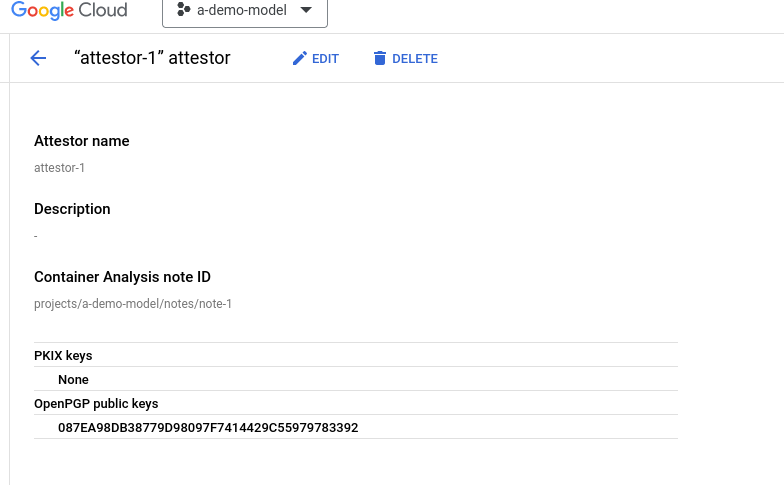


### Bob

Switch to Bob

```bash
gcloud config set account $BOB
```

Bob grants Alice use of the billing account

```bash
gcloud billing accounts list

    ACCOUNT_ID            NAME                  OPEN  MASTER_ACCOUNT_ID
    018B55-7FDD84-7F175A  bobs-billing-account  True


gcloud billing accounts add-iam-policy-binding 018B55-7FDD84-7F175A \
   --member="user:alice@domain.com" --role=roles/billing.user
```


at this point Alice can create a project to upload the image


#### Create Harness Project

Bob will also create a new project in his org where he will host the container images which Alice will later review an authorize

```bash
gcloud organizations get-iam-policy 673208786098

    bindings:
    - members:
      - user:bob@domain.com
      role: roles/billing.user
    - members:
      - user:bob@domain.com
      role: roles/resourcemanager.projectCreator
    - members:
      - user:bob@esodemoappdomain2.com
      role: roles/resourcemanager.projectIamAdmin


gcloud projects create $HARNESS_PROJECT
gcloud billing projects link $HARNESS_PROJECT  --billing-account=000C16-9779B5-30076F

gcloud config set project $HARNESS_PROJECT
```

#### Create Harness Image

Bob will create the harness image and save it to Artifact Registry

```bash
gcloud config set account $BOB
gcloud config set project $HARNESS_PROJECT

gcloud services enable artifactregistry.googleapis.com --project $HARNESS_PROJECT
gcloud artifacts repositories create repo1 --repository-format=docker --location=us-central1 --project $HARNESS_PROJECT

cd bob/harness
```

To build with docker,

```bash
cd bob/harness
docker build -t us-central1-docker.pkg.dev/$HARNESS_PROJECT/repo1/harness .
docker push us-central1-docker.pkg.dev/$HARNESS_PROJECT/repo1/harness 

## for me the image was us-central1-docker.pkg.dev/$HARNESS_PROJECT/repo1/harness@sha256:79bd5f912186c23fbd086440a18b4ea73aab1a52f0dc873dd2c22aab92b9e315
```

To build with Bazel:

Note, the following does *not* work yet;  while the binary runs, the container image base throws exception while initializing tink.  See [reference](https://gist.github.com/salrashid123/792bf7bc0e368dec66e3706db37ee1fc).  I'll figure this out later.

```bash
bazel build :main
bazel run :server_image

# to copy to a registry, use crate
# crane copy localhost:4000/harness:server_image us-central1-docker.pkg.dev/$HARNESS_PROJECT/repo1/harness
```

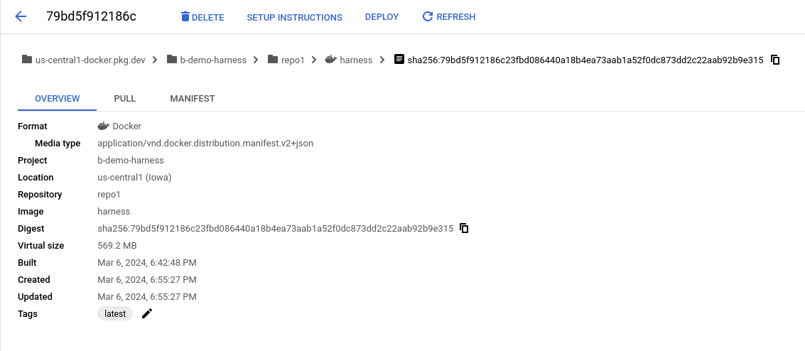

### Alice

Switch back to Alice

#### Sign image 

Sign the image in the MODEL PROJECT (this can be in any project but this demo uses the MODEL)

```bash
gcloud config set account $ALICE
gcloud config set project $MODEL_PROJECT

export HARNESS_IMAGE="us-central1-docker.pkg.dev/$HARNESS_PROJECT/repo1/harness@sha256:79bd5f912186c23fbd086440a18b4ea73aab1a52f0dc873dd2c22aab92b9e315"

gpg --list-keys
      --------------------------------
      pub   rsa2048 2024-03-02 [SC]
            087EA98DB38779D98097F7414429C55979783392
      uid           [ultimate] alice <alice@esodemoapp2.com>
      sub   rsa2048 2024-03-02 [E]


export PUBLIC_KEY_ID="087EA98DB38779D98097F7414429C55979783392"

gcloud auth configure-docker us-central1-docker.pkg.dev

gcloud container binauthz create-signature-payload --artifact-url=$HARNESS_IMAGE > /tmp/generated_payload.json

gpg --default-key $ALICE  \
      --pinentry-mode loopback  \
      --output /tmp/generated_signature.pgp \
        --clearsign  --detach-sig --sign /tmp/generated_payload.json


NOTE_URI="projects/$MODEL_PROJECT/notes/note-1"

cat > /tmp/note_payload.json << EOM
{
  "name": "${NOTE_URI}",
  "attestation": {
    "hint": {
      "human_readable_name": "gke sandbox attestor-1"
    }
  }
}
EOM

curl -X POST \
    -H "Content-Type: application/json" \
    -H "Authorization: Bearer $(gcloud auth print-access-token)"  \
    -H "x-goog-user-project: $MODEL_PROJECT" \
    --data-binary @/tmp/note_payload.json  \
    "https://containeranalysis.googleapis.com/v1/projects/$MODEL_PROJECT/notes/?noteId=note-1"


gcloud container binauthz attestations create \
          --artifact-url=$HARNESS_IMAGE \
          --attestor="projects/$MODEL_PROJECT/attestors/attestor-1" \
          --signature-file=/tmp/generated_signature.pgp \
          --public-key-id=$PUBLIC_KEY_ID  --project $MODEL_PROJECT

curl \
    -H "Authorization: Bearer $(gcloud auth print-access-token)"  \
    -H "x-goog-user-project: $MODEL_PROJECT" \
    "https://containeranalysis.googleapis.com/v1/projects/$MODEL_PROJECT/notes/"          


gcloud beta container binauthz attestations list --project $MODEL_PROJECT    
```

#### Create Folder and Project


Alice creates the Folder and sets an organization policy which enforces confidential-vm

```bash
gcloud config set account $ALICE

cd alice/

gcloud billing accounts list

  ACCOUNT_ID            NAME                                        OPEN   MASTER_ACCOUNT_ID
  018B55-7FDD84-7F175A  bobs-billing-account   True

gcloud resource-manager folders create  --display-name="sandbox-folder" --organization=673208786098

gcloud resource-manager folders list --organization=673208786098

      DISPLAY_NAME    PARENT_NAME                           ID
      sandbox-folder  organizations/673208786098  807172525594

# get the folderID
export FOLDER=807172525594

## create a project under that folder
gcloud projects create $CLUSTER_PROJECT --folder=807172525594   
gcloud billing projects link $CLUSTER_PROJECT  --billing-account=018B55-7FDD84-7F175A 

gcloud services enable  \
    containeranalysis.googleapis.com artifactregistry.googleapis.com  binaryauthorization.googleapis.com container.googleapis.com cloudkms.googleapis.com \
    --project $CLUSTER_PROJECT
```

#### Set Conf-VM Org policy

Alice sets the policy to use conf-vm's only

```bash
gcloud config set account $ALICE
gcloud config set project $MODEL_PROJECT
gcloud resource-manager org-policies set-policy org_policy.yaml --folder=807172525594

gcloud resource-manager org-policies list    --folder=807172525594

  CONSTRAINT                                            LIST_POLICY  BOOLEAN_POLICY  ETAG
  constraints/compute.restrictNonConfidentialComputing  SET          -               COmaqK4GENikmU0=
```

Folder

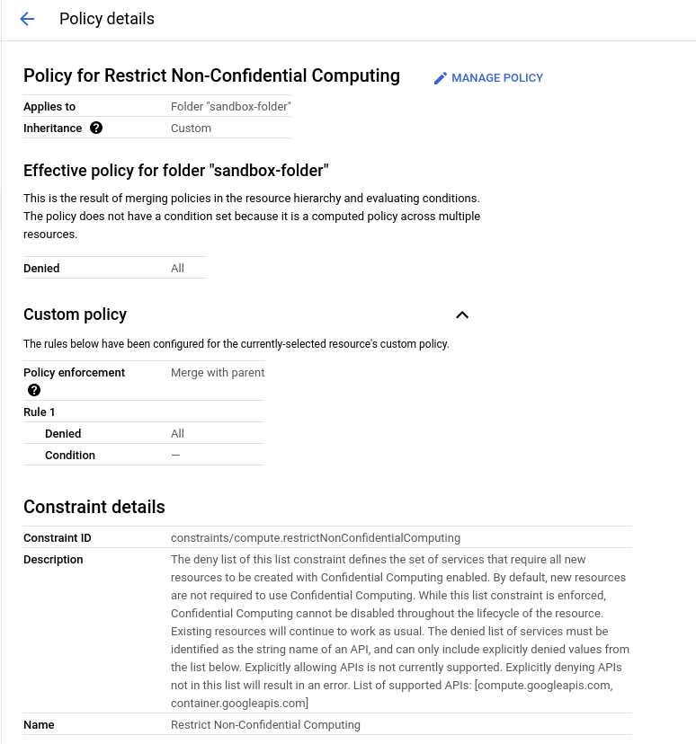


#### Optionally set IAM Deny policy


Alice can also optionally set an IAM Deny policy to further restrict access to the folder and project.  This step is optional

```bash
gcloud config set account $ALICE
gcloud config set project $MODEL_PROJECT
envsubst < "deny_policy.tmpl" > "/tmp/deny_policy.json"

gcloud iam policies create my-operator-policy \
    --attachment-point="cloudresourcemanager.googleapis.com/folders/$FOLDER" \
    --kind=denypolicies \
    --policy-file=/tmp/deny_policy.json --project=$CLUSTER_PROJECT
```


#### Authorize Cluster access to Attestation

Alice allows the service account in the cluster's project for binary authorization the ability to verify attestation.

```bash
gcloud config set account $ALICE
gcloud config set project $MODEL_PROJECT

gcloud container binauthz attestors add-iam-policy-binding attestor-1 \
   --member="serviceAccount:service-$CLUSTER_PROJECT_NUMBER@gcp-sa-binaryauthorization.iam.gserviceaccount.com" \
    --role=roles/binaryauthorization.attestorsVerifier --project $MODEL_PROJECT
```

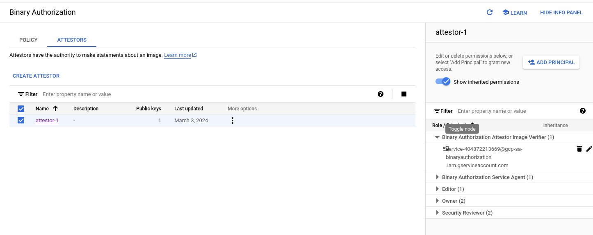

#### Create and Configure Cluster Binary Authorization

Alice then creates a binary authorization policy in the Cluster project

```bash
cd alice/
gcloud config set account $ALICE
gcloud config set project $CLUSTER_PROJECT

envsubst < "binauthz_policy.tmpl" > "/tmp/binauthz_policy.yaml"

gcloud container binauthz policy import /tmp/binauthz_policy.yaml --project $CLUSTER_PROJECT
```

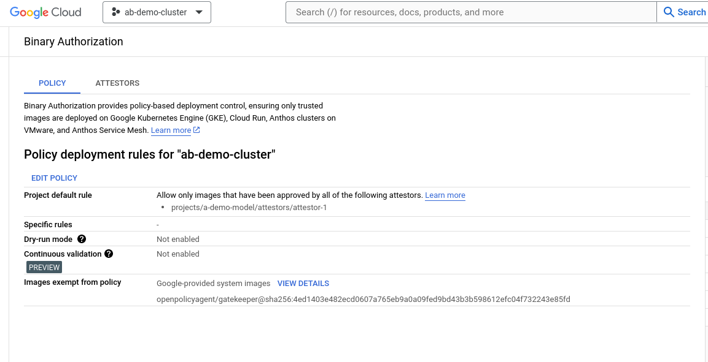


#### Create and configure Cluster

Alice is finally ready to create the cluster

```bash
gcloud config set account $ALICE
gcloud config set project $CLUSTER_PROJECT

# create service accounts for the node and workload federation
gcloud iam service-accounts create node-sa --project $CLUSTER_PROJECT
gcloud iam service-accounts create wif-svc --project $CLUSTER_PROJECT

export NODE_SA_EMAIL=node-sa@$CLUSTER_PROJECT.iam.gserviceaccount.com

gcloud compute ssl-policies create gke-ingress-ssl-policy-https     --profile MODERN     --min-tls-version 1.2 --project $CLUSTER_PROJECT

gcloud projects add-iam-policy-binding $CLUSTER_PROJECT --member=serviceAccount:$NODE_SA_EMAIL --role=roles/monitoring.metricWriter --project $CLUSTER_PROJECT
gcloud projects add-iam-policy-binding $CLUSTER_PROJECT --member=serviceAccount:$NODE_SA_EMAIL --role=roles/logging.logWriter --project $CLUSTER_PROJECT
gcloud projects add-iam-policy-binding $CLUSTER_PROJECT --member=serviceAccount:$NODE_SA_EMAIL --role=roles/artifactregistry.reader --project $CLUSTER_PROJECT

### now create the cluster

gcloud beta container  clusters create "cluster-1" --no-enable-basic-auth --cluster-version "1.29.0-gke.1381000" --release-channel "rapid" --machine-type "n2d-standard-2" --image-type "COS_CONTAINERD" --disk-type "pd-balanced" --disk-size "100" --metadata disable-legacy-endpoints=true --scopes "https://www.googleapis.com/auth/cloud-platform" --num-nodes "2" --logging=SYSTEM --monitoring=SYSTEM --enable-ip-alias --network "projects/$CLUSTER_PROJECT/global/networks/default" --subnetwork "projects/$CLUSTER_PROJECT/regions/us-central1/subnetworks/default" --no-enable-intra-node-visibility --default-max-pods-per-node "110" --security-posture=standard --workload-vulnerability-scanning=disabled --enable-network-policy --no-enable-master-authorized-networks --addons HorizontalPodAutoscaling,HttpLoadBalancing,GcePersistentDiskCsiDriver --no-enable-autoupgrade --no-enable-autorepair  --enable-managed-prometheus --enable-shielded-nodes --shielded-integrity-monitoring --shielded-secure-boot --node-locations "us-central1-a"  --enable-network-policy  --enable-service-externalips  --enable-confidential-nodes --enable-kubernetes-alpha --region=us-central1-a --service-account=$NODE_SA_EMAIL --workload-metadata=GKE_METADATA --workload-pool=$CLUSTER_PROJECT.svc.id.goog --binauthz-evaluation-mode=PROJECT_SINGLETON_POLICY_ENFORCE --project $CLUSTER_PROJECT

# configure workload federation on namespace=ns1
gcloud iam service-accounts add-iam-policy-binding \
  --role roles/iam.serviceAccountTokenCreator \
  --member "serviceAccount:$CLUSTER_PROJECT.svc.id.goog[ns1/tee-sa]" wif-svc@$CLUSTER_PROJECT.iam.gserviceaccount.com
```

#### Authorize Cluster to use Harness Image

Switch to Bob.

Authorize the node's service account access to read the container/harness

```bash
gcloud config set account $BOB
gcloud config set project $HARNESS_PROJECT

gcloud artifacts repositories  add-iam-policy-binding repo1 --location=us-central1 \
   --member=serviceAccount:$NODE_SA_EMAIL --role=roles/artifactregistry.reader --project $HARNESS_PROJECT
```

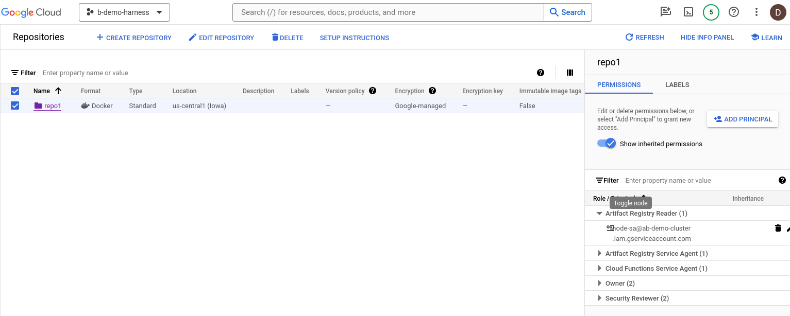


#### Authorize Cluster access KMS and Storage Bucket

Switch to Alice

Alice authorizes the workload's service account access to the KMS key and encrypted model in GCS

```bash
gcloud config set account $ALICE
gcloud config set project $MODEL_PROJECT

gcloud storage buckets add-iam-policy-binding \
    gs://$MODEL_PROJECT-bucket --member="serviceAccount:wif-svc@$CLUSTER_PROJECT.iam.gserviceaccount.com" \
     --role="roles/storage.objectViewer" --project $MODEL_PROJECT

gcloud kms keys add-iam-policy-binding key1 \
       --keyring=mykeyring --location=us-central1 \
        --member="serviceAccount:wif-svc@$CLUSTER_PROJECT.iam.gserviceaccount.com" \
        --role=roles/cloudkms.cryptoKeyDecrypter --project $MODEL_PROJECT
```

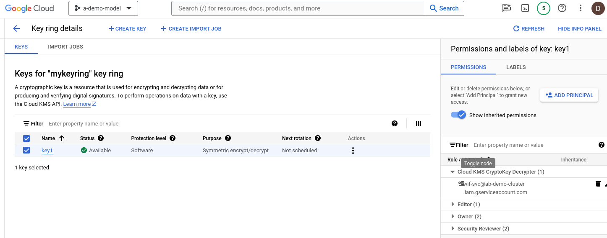


#### Create Cluster Sandbox

Alice creates the namespaces's service account for Bob to use

```bash
gcloud config set account $ALICE
gcloud config set project $CLUSTER_PROJECT
gcloud container clusters get-credentials cluster-1 --project $CLUSTER_PROJECT --region=us-central1-a

cd alice/deploy

envsubst < "serviceaccount.tmpl" > "/tmp/serviceaccount.yaml"
kubectl apply -f ns.yaml -f /tmp/serviceaccount.yaml

kubectl create clusterrolebinding cluster-admin-binding \
    --clusterrole cluster-admin \
    --user $ALICE
```

Alice will also deploy Gatekeeper

The following downloads gatekeeper and changes the image to use the image hash value instead.  This is done because we allowlist Gatekeeper usage through Binary Authorization
```bash
# wget https://raw.githubusercontent.com/open-policy-agent/gatekeeper/v3.15.0/deploy/gatekeeper.yaml
# edit gatekeeper.yaml
# change    openpolicyagent/gatekeeper:v3.15.0 =>   openpolicyagent/gatekeeper@sha256:4ed1403e482ecd0607a765eb9a0a09fed9bd43b3b598612efc04f732243e85fd  

## install gatekeeper by image hash
kubectl apply -f gatekeeper/gatekeeper.yaml

# constraint allowed Bob's GCR repos
# https://github.com/open-policy-agent/gatekeeper-library/blob/master/library/general/allowedrepos/template.yaml
kubectl apply -f gatekeeper/template.yaml  

envsubst < "gatekeeper/constraint.tmpl" > "/tmp/constraint.yaml"
kubectl apply -f /tmp/constraint.yaml

$ kubectl get constraints
NAME          ENFORCEMENT-ACTION   TOTAL-VIOLATIONS
repo-is-gcr                        
```

#### Configure RBAC and IAM

Alice now configures kubernetes RBAC to allow Bob only certain actions

```bash
cd alice/deploy
envsubst < "rbac.tmpl" > "/tmp/rbac.yaml"
kubectl apply -f /tmp/rbac.yaml

## also allow bob to authenticate to the cluster

gcloud projects add-iam-policy-binding $CLUSTER_PROJECT --member=user:$BOB \
    --role=roles/container.viewer  --project $CLUSTER_PROJECT
```

###  Deploy Harness

Switch to Bob and deploy code into the cluster

```bash
gcloud config set account $BOB
gcloud config set project $CLUSTER_PROJECT
gcloud container clusters get-credentials cluster-1 --project $CLUSTER_PROJECT --region=us-central1-a

cd bob/deploy

echo $HARNESS_IMAGE

envsubst < "deployment.tmpl" > "/tmp/deployment.yaml"

kubectl apply -f service.yaml -f serviceaccount.yaml -f secret.yaml -f ingress.yaml -f /tmp/deployment.yaml
```

You should see the deployment and Ingress loadbalancer startup:

```bash
kubectl get no,po,svc,serviceaccounts,ing -n ns1

    NAME                                            STATUS   ROLES    AGE   VERSION
    node/gke-cluster-1-default-pool-178784a5-jx57   Ready    <none>   84m   v1.29.0-gke.1381000
    node/gke-cluster-1-default-pool-178784a5-v0gm   Ready    <none>   84m   v1.29.0-gke.1381000

    NAME                                READY   STATUS        RESTARTS       AGE
    pod/fe-deployment-79c876ccf-44r8w   1/1     Running       0              14s
    pod/fe-deployment-79c876ccf-dzt54   1/1     Running       0              14s

    NAME                     TYPE        CLUSTER-IP    EXTERNAL-IP   PORT(S)   AGE
    service/fe-srv-ingress   ClusterIP   10.12.7.117   <none>        443/TCP   70m

    NAME                       SECRETS   AGE
    serviceaccount/custom-sa   0         70m
    serviceaccount/default     0         79m
    serviceaccount/tee-sa      0         79m

    NAME                                   CLASS   HOSTS              ADDRESS       PORTS     AGE
    ingress.networking.k8s.io/fe-ingress   gce     llama.domain.com   35.190.0.48   80, 443   70m
```

Workloads:

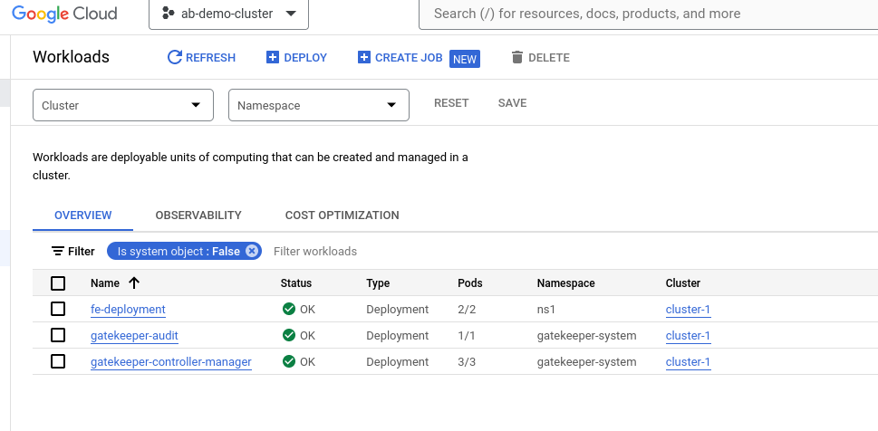

Ingress:

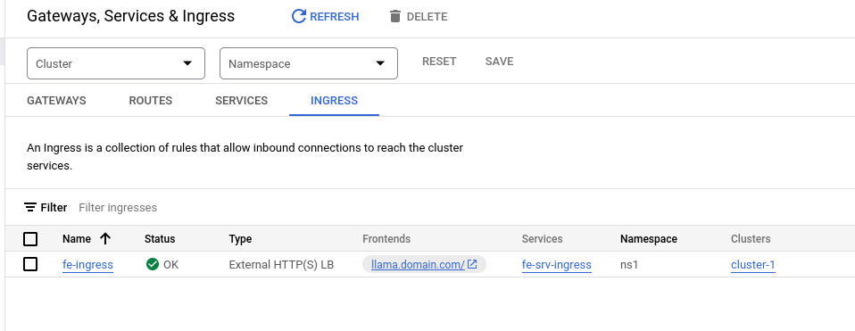

Services:

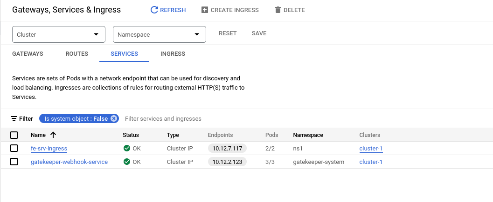

GKE Configuration

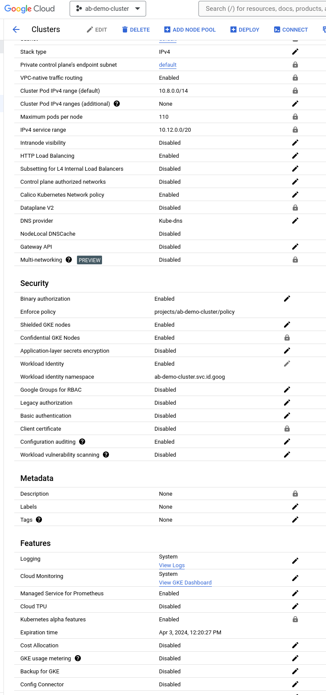


Note that exec, ssh and token creation is denied for bob:

```bash
$ kubectl exec -ti pod/fe-deployment-79c876ccf-44r8w  /bin/bash -n ns1
    kubectl exec [POD] [COMMAND] is DEPRECATED and will be removed in a future version. Use kubectl exec [POD] -- [COMMAND] instead.
    Error from server (Forbidden): pods "fe-deployment-79c876ccf-44r8w" is forbidden: User "bob@esodemoapp2.com" cannot create resource "pods/exec" in API group "" in the namespace "ns1": requires one of ["container.pods.exec"] permission(s)

$  kubectl create token tee-service-account -n ns1 --bound-object-kind Pod --bound-object-name app-68c7d4bfbf-nslqs --audience=foo
        error: failed to create token: serviceaccounts "tee-service-account" is forbidden: User "bob@esodemoapp2.com" cannot create resource "serviceaccounts/token" in API group "" in the namespace "ns1": requires one of ["container.serviceAccounts.createToken"] permission(s).

$ gcloud compute ssh gke-cluster-1-default-pool-178784a5-jx57 --zone=us-central1-a
        ERROR: (gcloud.compute.ssh) Could not fetch resource:
        - Required 'compute.instances.get' permission for 'projects/ab-demo-cluster/zones/us-central1-a/instances/gke-cluster-1-default-pool-178784a5-jx57'

$ kubectl get secrets -n ns1
      NAME        TYPE                DATA   AGE
      fe-secret   kubernetes.io/tls   2      4m42s
```

Now we can finally access the ML model.

To access as a frontend:

edit `/etc/hosts` and set the ingress value

```
35.190.0.48	llama.domain.com
```

Then go to `https://llama.domain.com/`, accept the cert warning (or import `certs/root-ca.crt` if you really want to), then

click `Check()`:  this step simply verifies if the sensitive machine learning model was downloaded, decrypted and verified.

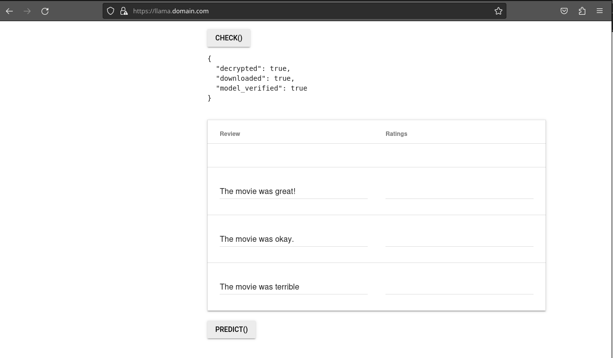

after that, you can run inference:

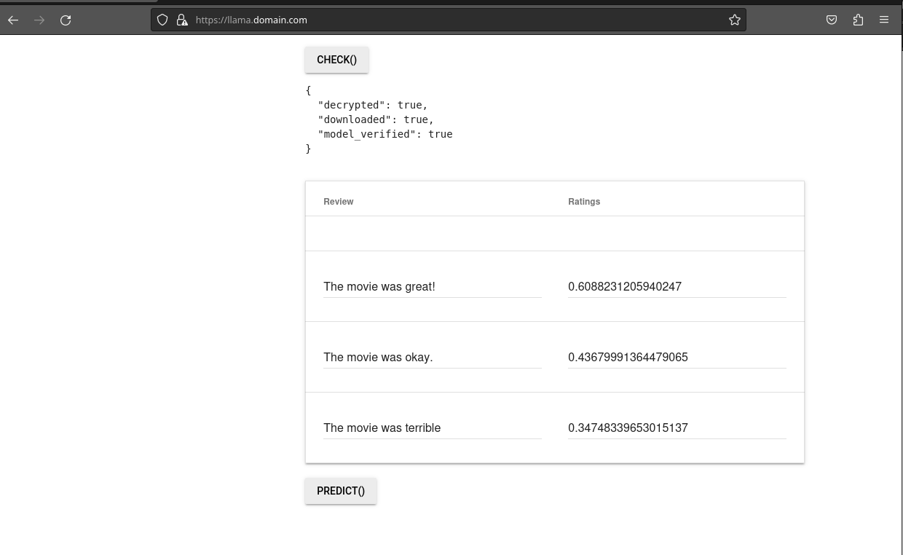

you can also access it via cli:

```bash
curl -s --cacert certs/root-ca.crt  --resolve  llama.domain.com:443:35.190.0.48   -H "Content-Type: application/json"  \
       -X POST      --data '{ "reviews": ["The movie was great!","The movie was okay.","The movie was terrible..."]}'   https://llama.domain.com/predict

[[0.6088231]
 [0.4367999]
 [0.3474834]]
```
